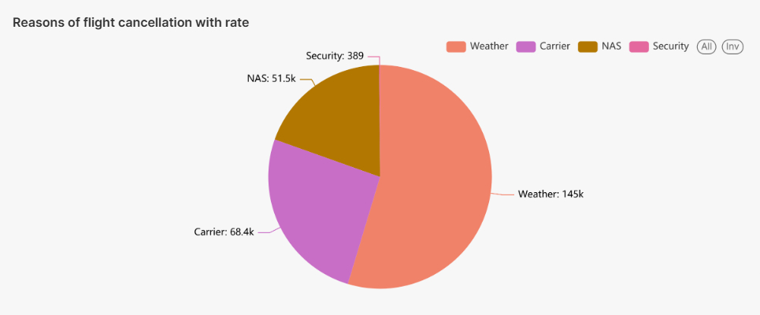

# Big Data Project: US Flight Analysis & Prediction

This repository is a template for the final project of the Big Data course. It provides a structured environment to build an end-to-end pipeline for analyzing US domestic flight data, performing exploratory data analysis (EDA), and building predictive models (e.g., for flight cancellations or delays).

## Project Overview

The pipeline performs the following key stages:
1.  **Data Collection:** Downloads US flight data from Kaggle and performs initial Python-based preprocessing.
2.  **Relational DB Storage:** Builds a PostgreSQL database and ingests the preprocessed data.
3.  **HDFS Ingestion:** Uses Sqoop to import data from PostgreSQL into HDFS as AVRO files with Snappy compression.
4.  **Data Warehousing & EDA:** Sets up Hive external tables on the HDFS data, performs optimizations, and runs HQL queries for EDA.
5.  **Predictive Data Analytics:** Uses Spark ML to train, evaluate, and compare models (e.g., Logistic Regression, Random Forest) for predicting flight outcomes.

## Prerequisites

1.  **Python 3.x**
2.  **Required Python Packages:**
    ```bash
    pip install -r requirements.txt
    ```
3.  **Kaggle API Key:** Ensure your `kaggle.json` is set up for downloading datasets.
4.  **Access to Innopolis University Hadoop Cluster:** Credentials for PostgreSQL, Hive, and HDFS.
5.  **Secrets:** Create a `secrets/` directory in the project root and add:
    *   `secrets/.psql.pass`: Containing your PostgreSQL password on a single line.
    *   `secrets/.hive.pass`: Containing your Hive password on a single line.

## Project Structure

-   `data/`: Contains the dataset files (raw and processed).
-   `models/`: Contains the trained Spark ML models.
-   `notebooks/`: Jupyter/Zeppelin notebooks for experimentation and learning (not used in the final pipeline).
-   `output/`: Stores results like CSVs, text files, images from the pipeline.
-   `scripts/`: Contains all `.sh` and `.py` scripts for pipeline stages.
-   `sql/`: Contains all `.sql` (PostgreSQL) and `.hql` (HiveQL) files.
-   `requirements.txt`: Python package dependencies.
-   `main.sh`: The **main script** to execute the entire pipeline.

## How to Run

1.  Ensure all prerequisites are met and secrets are in place.
2.  From the project root directory, execute:
    ```bash
    ssh team15@hadoop-01.uni.innopolis.ru -p 22
    cd BigData-project
    source ./venv/bin/activate
    ```
3.  All results and artifacts will be stored in the `output/` directory.

## Project Insights


## Important Notes for Students

*   **`main.sh` is Immutable:** You **cannot** change the content of `main.sh`. The grader will run this script as-is to assess your project. Ensure your individual scripts are correctly called and function as expected within `main.sh`.
*   **Notebooks are for Learning Only:** The `notebooks/` folder is for your exploration. Your final pipeline logic must be in `.py` scripts within the `scripts/` folder. The `notebooks/` folder might be deleted during grading to ensure your pipeline doesn't depend on its content.
*   **Idempotency:** Ensure your scripts can be run multiple times without errors (e.g., by dropping tables/directories before creating them).
*   **Paths:** All scripts should be runnable from the project's root directory.
